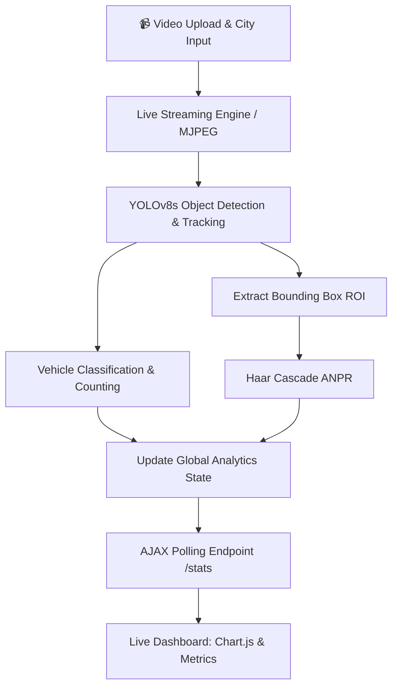

# 🚦 AI-Powered Traffic Monitoring & ANPR Dashboard

[](https://www.python.org/)
[](https://flask.palletsprojects.com/)
[](https://opencv.org/)
[](https://github.com/ultralytics/ultralytics)
[](LICENSE)

An intelligent, state-of-the-art computer vision and web-based traffic surveillance system. It performs real-time vehicle classification, multi-object tracking, Automatic Number Plate Recognition (ANPR), and live traffic density profiling with a beautiful, modern dashboard.

---

## 📌 Key Features

- **🚗 Advanced Vehicle Detection:** Detects and classifies cars, buses, trucks, and motorcycles using the **YOLOv8s** deep neural network for high accuracy and speed.
- **🎯 Real-Time Object Tracking:** Uses YOLOv8's native tracking capabilities to uniquely identify and track vehicles across video frames, preventing duplicate counts.
- **🔍 Automatic Number Plate Recognition (ANPR):** Scans the interior of detected vehicles using OpenCV Haar Cascades (`haarcascade_russian_plate_number.xml`) to locate and track license plates.
- **📊 Live Analytics Dashboard:** 
  - Dynamic **Chart.js** bar graphs update in real-time as the video streams.
  - Automatically calculates and displays the **Highest Traffic Consumer** (dominating vehicle class).
- **📹 Instant MJPEG Video Streaming:** No more waiting for videos to process! Upload a video and instantly watch the AI process and annotate frames live in your browser.
- **🌤️ Integrated Climate Conditions:** Enter your city on upload to fetch and display real-time weather data (`wttr.in`) directly on your dashboard.
- **✨ Premium UI/UX:** Built with a modern dark-mode Glassmorphism aesthetic, smooth micro-animations, and a responsive two-page layout (`index.html` -> `dashboard.html`).

---

## 🏗️ System Architecture & Workflow



---

## 📂 Project Structure

```plaintext
traffic_monitoring_web/
├── app.py                 # Core Flask app, YOLOv8 pipeline, and MJPEG streaming
├── requirements.txt       # Project dependencies
├── .gitignore             # Git ignore configuration
├── haarcascade_russian_plate_number.xml # Haar cascade for ANPR
├── yolov8s.pt             # YOLOv8 small model (auto-downloads if missing)
├── templates/
│   ├── index.html         # Landing page (Upload & Weather input)
│   └── dashboard.html     # Live analysis dashboard (Video stream & Charts)
└── static/                # Static assets, uploads, and output graphs
    └── .gitkeep
```

---

## ⚡ Quick Start & Installation

### 1. Clone the Repository
```bash
git clone https://github.com/shasankk/traffic_monitoring_web.git
cd traffic_monitoring_web
```

### 2. Set Up a Virtual Environment
```bash
# Windows
python -m venv venv
venv\Scripts\activate

# Linux / macOS
python3 -m venv venv
source venv/bin/activate
```

### 3. Install Dependencies
```bash
pip install -r requirements.txt
```

*(Note: YOLOv8 model weights `yolov8s.pt` will automatically download on your first run!)*

---

## 🚀 Running the Application

1. **Start the Flask Web Server:**
   ```bash
   python app.py
   ```
2. **Access the Web Interface:**
   Open your browser and navigate to `http://localhost:5000`.

3. **Analyze Traffic Live:**
   - Enter your city name for live weather tracking.
   - Upload any traffic surveillance video (`.mp4`, `.avi`, `.mov`).
   - Click **Start Analysis**.
   - Watch the live MJPEG stream and see the traffic density charts update in real time!

---

## 🛠️ Tech Stack

- **Backend:** Python 3.10+, Flask
- **Computer Vision:** YOLOv8 (`ultralytics`), OpenCV (`cv2`)
- **Data Visualization:** Chart.js
- **Frontend:** HTML5, Vanilla CSS3 (Glassmorphism), JavaScript (AJAX)
- **External APIs:** REST API (`wttr.in` for weather)

---

## 🤝 Contributing

Contributions, issues, and feature requests are welcome!
1. Fork the Project
2. Create your Feature Branch (`git checkout -b feature/AmazingFeature`)
3. Commit your Changes (`git commit -m 'Add some AmazingFeature'`)
4. Push to the Branch (`git push origin feature/AmazingFeature`)
5. Open a Pull Request

---

## 📄 License

Distributed under the MIT License. See `LICENSE` for more details.